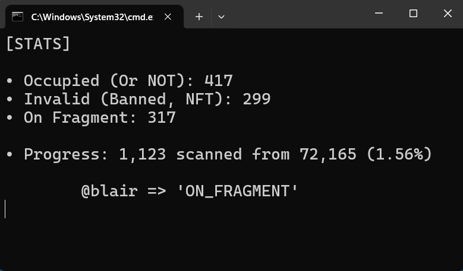
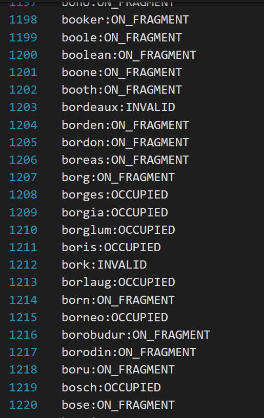

# Telegram Usernames Scanner

<b>Telegram usernames scanner</b> can scan usernames and specify their status. 

<p align="center">


</p>

💠 Three mode available:

1. Occupied (username is claimable or already taken) ✅
2. Invalid (username is banned or is collectible NFT) 🚫
3. On Fragment (username is for sale or auction proceed) 🌀

## Features

- Easy to Use
- Interactive console statistics
- Unlimited and Reliable

## Requirements

1. Python 3.10+
2. Telethon

## Setup

- git clone https://github.com/amirfabo/telegram-scanner.git
- cd telegram-scanner
- pip install -r requirements.txt

## ⚠️ Note before using

⬇️ You must edit the configuration file values (<code>settings.ini</code>) like below:

1. First replace Telegram API authentication info ([generate](https://my.telegram.org/))
2. Second save and replace String Session hash of your telethon session. ([See more](http://docs.telethon.dev/en/stable/concepts/sessions.html#string-sessions))
3. `result_file = ./result.txt` option to set the name of output file.
4. `delimiter = :` option to set separator of username and its status in output file.  

## Usage

<i>Enter relative/absolute file path of wordlist in interactive mode or pass as argument:</i>

```bash
# interactive mode
$ python3 scanner.py

[ASK] Enter the word list file path: /home/dict/wordlist.txt
```

### OR

```bash
# absolute file path
$ python3 scanner.py /home/dict/wordlist.txt

# relative file path
$ cd /home/dict
$ python3 scanner.py ./wordlist.txt
```