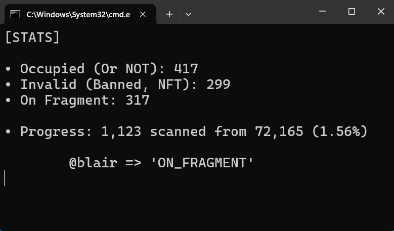
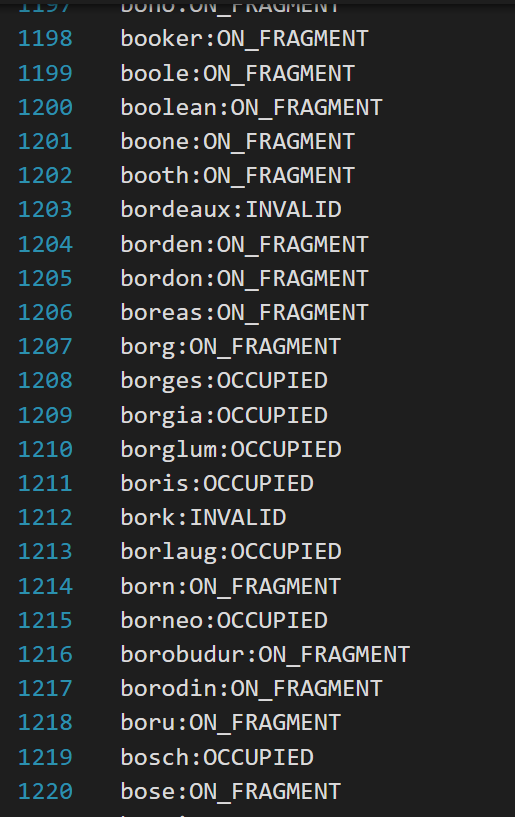

## Telegram Username Scanner

A powerful tool for scanning Telegram usernames.

<p align="center">


</p>

### Features

- Fast
- Easy to Use
- Unlimited and Reliable

### Requirements

1. Python 3.10+
2. Telethon

### Setup

```
$ git clone https://github.com/amirfabo/telegram-scanner.git
$ cd telegram-scanner
$ pip install -r requirements.txt
```

You must edit `settings.ini` file (or make your config file with `[general]` section):

- `api_id` and `api_hash`, see <a href="https://my.telegram.org">here</a>.
- `string_session`, see <a href="https://docs.telethon.dev/en/stable/concepts/sessions.html">here</a>.

### Usage

*1. Basic:*
```bash
$ python main.py <filename>
```
*2. Specific output file:*
```bash
$ python main.py -o <output> <filename>
```
*3. Specific configuration:*
```bash
$ python main.py -c <config> <filename>
```

### Username Status:

1. **Occupied** (*is claimable or already taken*) ✅
2. **~~Not Occupied~~** (*Not currently supported*)
2. **Invalid** (*banned or is collectible NFT*) 🚫
3. **On Fragment** (*for sale or auction proceed*) 🔄